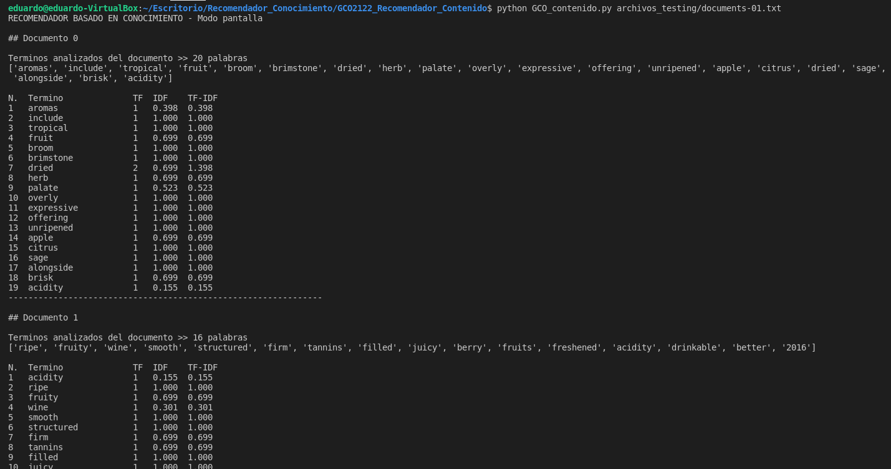
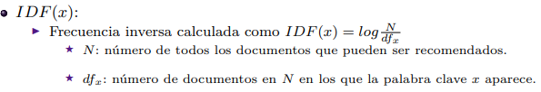
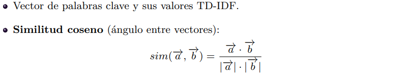
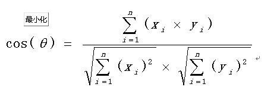

# GCO: Sistemas de recomendación. Modelos basados en CONTENIDO

- **Autor:** Eduardo Da Silva Yanes
- **Asignatura:** Gestión del conocimiento en las organizaciones
- **Centro:** ESIT - Universidad de La Laguna

***

## Enlaces
1. [Ficheros de entrada](https://github.com/EduardoSY/GCO2122_Recomendador_Contenido/tree/main/archivos_testing)
2. [Resultados de los ficheros de entrada](https://github.com/EduardoSY/GCO2122_Recomendador_Contenido/tree/main/archivos_salida)

## Objetivo de la práctica:

El objetivo de esta práctica es implementar un sistema de recomendación siguiendo el modelo basados en el contenido.

## Ejemplo de uso
Los ficheros de entrada son ficheros de texto. Cada línea del fichero se considera un documento. Además, para que se puedan eliminar las "stop-words", el contenido debe estar en inglés.

Este es un ejemplo de fichero:

```
Aromas include tropical fruit, broom, brimstone and dried herb. The palate isn't overly expressive, offering unripened apple, citrus and dried sage alongside brisk acidity.
This is ripe and fruity, a wine that is smooth while still structured. Firm tannins are filled out with juicy red berry fruits and freshened with acidity. It's  already drinkable, although it will certainly be better from 2016.
Tart and snappy, the flavors of lime flesh and rind dominate. Some green pineapple pokes through, with crisp acidity underscoring the flavors. The wine was all stainless-steel fermented.
Pineapple rind, lemon pith and orange blossom start off the aromas. The palate is a bit more opulent, with notes of honey-drizzled guava and mango giving way to a slightly astringent, semidry finish.
Much like the regular bottling from 2012, this comes across as rather rough and tannic, with rustic, earthy, herbal characteristics. Nonetheless, if you think of it as a pleasantly unfussy country wine, it's a good companion to a hearty winter stew.
Blackberry and raspberry aromas show a typical Navarran whiff of green herbs and, in this case, horseradish. In the mouth, this is fairly full bodied, with tomatoey acidity. Spicy, herbal flavors complement dark plum fruit, while the finish is fresh but grabby.
Here's a bright, informal red that opens with aromas of candied berry, white pepper and savory herb that carry over to the palate. It's balanced with fresh acidity and soft tannins.
This dry and restrained wine offers spice in profusion. Balanced with acidity and a firm texture, it's very much for food.
Savory dried thyme notes accent sunnier flavors of preserved peach in this brisk, off-dry wine. It's fruity and fresh, with an elegant, sprightly footprint.
This has great depth of flavor with its fresh apple and pear fruits and touch of spice. It's off dry while balanced with acidity and a crisp texture. Drink now.
```

### Ejecución del programa

Si queremos que la información se nos muestre en la consola hacemos ejecutamos el comando de la siguiente manera:

```bash
...$ python GCO_contenido.py archivo_entrada.txt
```

En la siguiente imagen se muestra un ejemplo real de uso.



En caso de querer que la información se guarde en un fichero debemos añadir el argumento ```-o fichero_salida.txt```

Aquí un ejemplo real:

```bash
...$ python GCO_contenido.py archivos_testing/documents-01.txt -o archivos_salida/salida_documents-01.txt
```

Para comprobar el correcto funcionamiento de la práctica se han empleado los ficheros proporcionados por el profesor así como algún otro fichero creado para testear cuestiones específicas:

| Fichero de entrada | Fichero de salida |
| -- | -- |
| [documents-01.txt](./archivos_testing/documents-01.txt) | [salida_documents-01.txt](./archivos_salida/salida_documents-01.txt) |
| [documents-02.txt](./archivos_testing/documents-02.txt) | [salida_documents-02.txt](./archivos_salida/salida_documents-02.txt) |
| [documents-03.txt](./archivos_testing/documents-03.txt) | [salida_documents-03.txt](./archivos_salida/salida_documents-03.txt) |
| [documento_similares.txt](./archivos_testing/documento_similares.txt) | [salida_documento_similares.txt](./archivos_salida/salida_documento_similares.txt) |


***

## Descripción de la implementación:
Para poder calcular la similitud entre documentos debemos primero calcular 3 valores: TF, IDF y TF-IDF

### Lectura del fichero y eliminación de palabras (stopwords)
Lo primero que hacemos es filtrar aquellas palabras que carecen de valor como son los artículos, conectores, preposiciones, etc.

Para ello cargamos un fichero de stopwords y filtramos las palabras. Si el término que estamos analizando se encuentra en esta lista es descartada.

```python
#--- Eliminar stopwords ---
stop_words = []
f = open('stopwords_english_fixed.txt', 'r')
stop_words = f.read()
f.close()

# Analizar palabras y descartar stopwords
for t in range(len(terminos)):
    for i in range(len(terminos[t])):
         if terminos[t][i] in stop_words:
            # Los elementos que queremos descartar los sustituimos por -
            terminos[t][i] = "-"

# Anadir elementos que no son - (palabra eliminada)
for l in range(len(terminos)):
    terminos[l] = [i for i in terminos[l] if i != "-"]
```

### Matriz para almacenar los valores TF, IDF y TF-IDF
Para almacenar los valores mencionados de cada uno de los términos y la relación con cada documento se ha implementado una matriz de la siguiente manera.

Lo primero es identificar qué terminos han aparecido en el fichero y almacenarlos. En este vector no hay términos repetidos.

```python
# Palabras analizadas (sin repetirse)
terminos_unicos = []
for doc_list in terminos:
    for elemento in doc_list:
        if elemento not in terminos_unicos:
            terminos_unicos.append(elemento)
```

Una vez hecho esto se crea la matriz.

```python
# Matriz de terminos donde se almacenan los valores [TF, IDF, TF-IDF]
matriz_terminos = [ [ [0,0,0] for y in range(len(terminos_unicos)) ] for x in range( len(terminos)) ] #Primero pongo col, luego filas
```

Cada posición de la matriz (documento-término) guarda un array de 3 valores de la siguiente manera >> [TF, IDF, TF-IDF]

Internamente sería algo así:

DOC\TERMS | aromas | include | ...  |
--- | --- | --- |--- |
Documento1 | \[1, 0.398, 0.398] | \[1, 1.000, 1.000]  | ...  |
... | ... | ...  | ...  |

### 1. TF
El valor TF ("Term Frecuency") lo calculamos en base a la cantidad de veces que aparece un determinado término en un documento. Simplemente contamos la cantidad de veces que aparece.

La implementación hecha es la siguiente:

```python
# Contar cantidad de veces que aparece las palabras
def CountFrequency(my_list):
    count = {}
    for i in my_list:
        count[i] = count.get(i, 0) + 1
    return count

# Rellenar la matriz con TF
def calc_TF():
    for doc in range(len(terminos)):
        recuento = CountFrequency(terminos[doc])
        for k,v in recuento.items():
            matriz_terminos[doc][terminos_unicos.index(k)][0] = v
```

### 2. IDF

IDF ("Inverse Document Frequency") nos indica la frecuencia con la que aparece el término en la colección de documentos. El cálculo se realiza de la siguiente manera:



Es importante destacar que el logaritmo empleado es el logaritmo en base 10, no el logaritmo neperiano (base e).

Se ha implementado de la siguiente manera:

```python
#Calcular IDF
def calc_IDF():
    N = len(matriz_terminos)
    for i in range(len(matriz_terminos)):
        for j in range(len(matriz_terminos[i])):
            docs_aparece = 0
            # Buscar si la palabra aparece en los documentos
            for cont in range(len(matriz_terminos)):
                if (matriz_terminos[cont][j][0] != 0): # SI TF != 0 significa que al menos ha aparecido una vez
                    docs_aparece += 1 #La palabra aparece en el documento
            
            valor = math.log((N/ float(docs_aparece)),10)
            matriz_terminos[i][j][1] = valor
```

### 3. TF - IDF
Este es el último valor a calcular antes de poder calcular la similitud entre documentos. Este valor se calcula simplemente como el producto entre los valores TF e IDF.

```python
#Calcular TF-IDF
def calc_TF_IDF():
    for i in range(len(matriz_terminos)):
        for j in range(len(matriz_terminos[i])):
            matriz_terminos[i][j][2] =  matriz_terminos[i][j][0] *  matriz_terminos[i][j][1]
```

Todos los valores calculados hasta ahora se muestran gracias a la función **```show_doc_data()```**.

El resultado de esta operación con el fichero de prueba [documents-01.txt](https://github.com/EduardoSY/GCO2122_Recomendador_Contenido/blob/main/archivos_testing/documents-01.txt) es el siguiente:

```
## Documento 0

Terminos analizados del documento >> 20 palabras
['aromas', 'include', 'tropical', 'fruit', 'broom', 'brimstone', 'dried', 'herb', 'palate', 'overly', 'expressive', 'offering', 'unripened', 'apple', 'citrus', 'dried', 'sage', 'alongside', 'brisk', 'acidity']

N.  Termino              TF  IDF    TF-IDF
1   aromas               1   0.398  0.398 
2   include              1   1.000  1.000 
3   tropical             1   1.000  1.000 
4   fruit                1   0.699  0.699 
5   broom                1   1.000  1.000 
6   brimstone            1   1.000  1.000 
7   dried                2   0.699  1.398 
8   herb                 1   0.699  0.699 
9   palate               1   0.523  0.523 
10  overly               1   1.000  1.000 
11  expressive           1   1.000  1.000 
12  offering             1   1.000  1.000 
13  unripened            1   1.000  1.000 
14  apple                1   0.699  0.699 
15  citrus               1   1.000  1.000 
16  sage                 1   1.000  1.000 
17  alongside            1   1.000  1.000 
18  brisk                1   0.699  0.699 
19  acidity              1   0.155  0.155 
---------------------------------------------------------------
```

### 4. Calculo de la similitud.
Todos los cálculos que hagamos se van a guardar en una matriz de similitud de documentos, que será la siguiente:

```python
# Matriz de similitud de documentos
matriz_sim = [ [ 0 for y in range(len(terminos)) ] for x in range(len(terminos)) ] #Primero pongo col, luego filas
```

Para calcular la similitud entre dos documentos hacemos uso de la siguiente función.



Esta función se interpreta de la siguiente manera (x es a, y es b):



Para cada par de documentos aplicamos la formula y rellenamos la matriz de similitud de documentos. Como es de esperar, la diagonal nos debe dar 1.

Aquí un ejemplo del resultado al utilizar el fichero de prueba [documents-01.txt](https://github.com/EduardoSY/GCO2122_Recomendador_Contenido/blob/main/archivos_testing/documents-01.txt)

```
### SIMILITUD ENTRE DOCUMENTOS ###

           [D.0]    [D.1]    [D.2]    [D.3]    [D.4]    [D.5]    [D.6]    [D.7]    [D.8]    [D.9]    
[Doc 0] -> 1.000    0.002    0.002    0.029    0.000    0.039    0.070    0.002    0.108    0.043    
[Doc 1] -> 0.002    1.000    0.010    0.000    0.007    0.002    0.086    0.070    0.049    0.049    
[Doc 2] -> 0.002    0.010    1.000    0.074    0.007    0.069    0.002    0.013    0.053    0.048    
[Doc 3] -> 0.029    0.000    0.074    1.000    0.000    0.039    0.033    0.000    0.037    0.000    
[Doc 4] -> 0.000    0.007    0.007    0.000    1.000    0.028    0.000    0.009    0.007    0.000    
[Doc 5] -> 0.039    0.002    0.069    0.039    0.028    1.000    0.022    0.002    0.028    0.013    
[Doc 6] -> 0.070    0.086    0.002    0.033    0.000    0.022    1.000    0.034    0.054    0.043    
[Doc 7] -> 0.002    0.070    0.013    0.000    0.009    0.002    0.034    1.000    0.010    0.228    
[Doc 8] -> 0.108    0.049    0.053    0.037    0.007    0.028    0.054    0.010    1.000    0.015    
[Doc 9] -> 0.043    0.049    0.048    0.000    0.000    0.013    0.043    0.228    0.015    1.000
```

El código implementado es el siguiente:

```python
def calc_sim_cos(doc1, doc2):
    numerador = 0
    denominador_izq = 0
    denominador_der = 0
    for i in range(len(terminos_unicos)):
       numerador += matriz_terminos[doc1][i][2] * matriz_terminos[doc2][i][2]
       denominador_izq += pow(matriz_terminos[doc1][i][2],2)
       denominador_der += pow(matriz_terminos[doc2][i][2],2)
    denominador = math.sqrt(denominador_der) * math.sqrt(denominador_izq)
    
    # En caso de error (denominador 0) lanzamos un error y terminamos.
    if denominador == 0:
        doc_error = 0
        if denominador_izq == 0:
            doc_error = doc1
        else:
            doc_error = doc2
        out_text = "ERROR: Division por cero -> Documento " + str(doc_error) + " es raro. Todos sus terminos tienen TF-IDF = 0. Por tanto todas las palabras aparecen en todos los documentos"
        raise SystemExit(out_text)
    
    return (numerador/float(denominador))

# Rellenar la matriz de similitud entre documentos
def fill_matriz_sim():
    for i in range(len(matriz_sim)):
        for j in range(len(matriz_sim[i])):
            matriz_sim[i][j] = calc_sim_cos(i,j)
```

Hacemos los cálculos por partes, calculando primero el numerador y luego el denominador separado en dos partes. Como se puede observar, comprobamos que el denominador no sea 0. Esta situación se puede dar cuando **todas las palabras de un documento** aparecen en todos y cada unos de los documentos restantes de tal manera que el cálculo de IDF sea:
log(N/N) = log(1) = 0 -> Lo cual implica que TF-IDF sea 0 también.

Si se da este caso lanzamos un error avisando del problema puesto que es una situación bastante excepcional y evitamos poner un valor aleatorio que altere los resultados.

Lo único que queda es mostrar los resultados haciendo uso de **```show_matriz_sim(matrix)```**, una función que simplemente imprime esta matriz de similitudes.
