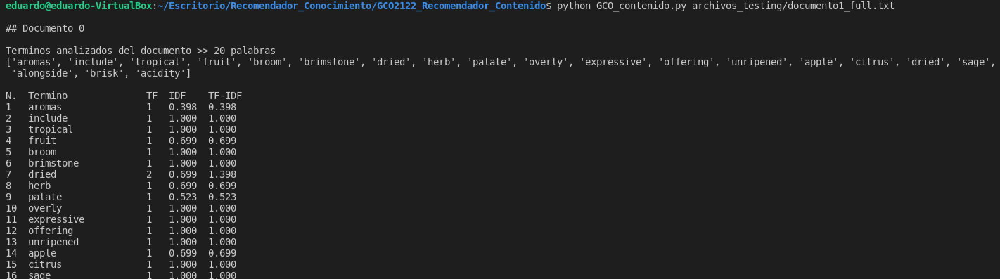

# GCO: Sistemas de recomendación. Modelos basados en CONTENIDO

- **Autor:** Eduardo Da Silva Yanes
- **Asignatura:** Gestión del conocimiento en las organizaciones
- **Centro:** ESIT - Universidad de La Laguna

***

### Objetivo de la práctica:

El objetivo de esta práctica es implementar un sistema de recomendación siguiendo el modelo basados en el contenido.

### Ejemplo de uso

Si queremos que la información se nos muestre en la consola hacemos ejecutamos el comando de la siguiente manera:

```bash
...$ python GCO_contenido.py archivo_entrada.txt
```

En la siguiente imagen se muestra un ejemplo real de uso.



En caso de querer que la información se guarde en un fichero debemos añadir otro argumento

### Descripción de la implementación:
Para poder calcular la similitud entre documentos debemos primero calcular 3 valores: TF, IDF y TF-IDF

#### TF
El valor TF ("Term Frecuency") lo calculamos en base a la cantidad de veces que aparece un determinado término en un documento. Simplemen contamos la cantidad de veces que aparece.

#### IDF

IDF ("Inverse Document Frequency") nos indica la frecuencia con la que aparece el término en la colección de documentos. El cálculo se realiza de la siguiente manera:


#### TF - IDF
Este es el último valor a calcular antes de poder calcular la similitud entre documentos. Este valor se calcula simplemente como el producto entre los valores TF e IDF.

